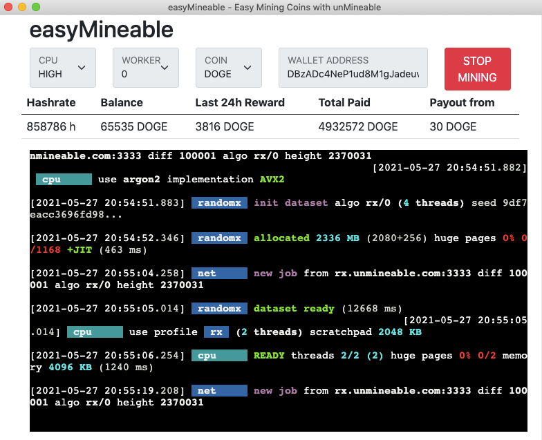

# [easyMineable](https://easymineable.com)

## Easy Mining Coins with [unMineable](https://www.unmineable.com/?ref=yjax-uulc)

Supported Platforms: Windows/MacOS/Linux

Supported Coins: Bitcoin, Dogecoin and 54 more different coins

Supported Mining: CPU (Integrated XMRig)

	<a class="button" href="https://github.com/easymineable/easymineable-desktop/releases" target="_blank" style="font-size: 32px; font-weight: bold;background-color: #00ad28; padding: 10px 20px; border-radius: 6px; color: #ffffff; text-decoration: none;outline: none;" >DOWNLOAD</a>

